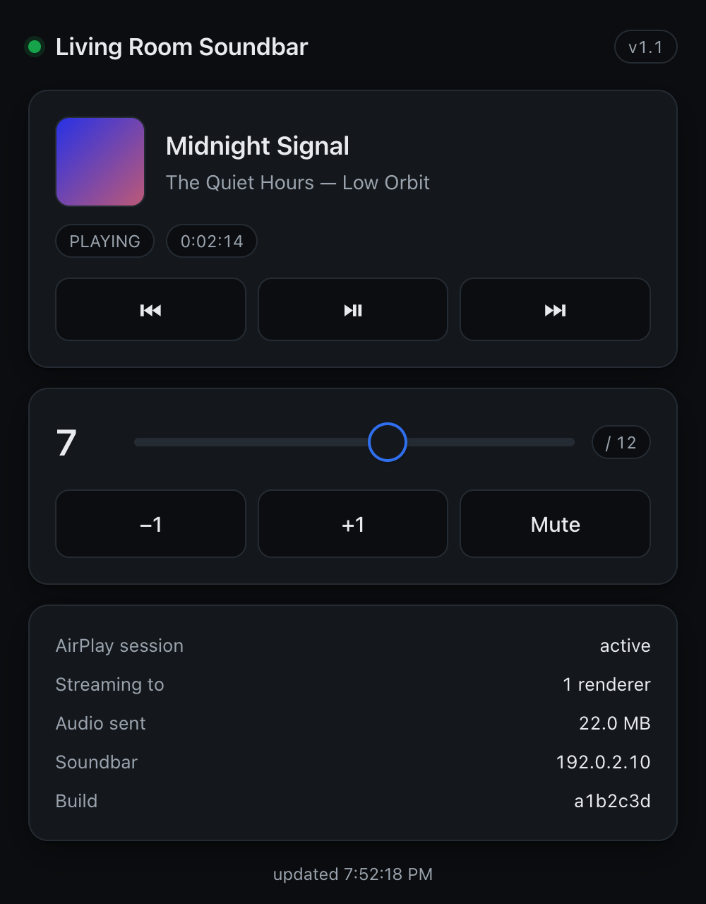

# airplay-dlna-bridge

Give an **AirPlay 2 receiver** to any speaker that only speaks UPnP/DLNA.

Plenty of networked speakers, soundbars and AV receivers expose a UPnP
MediaRenderer but have no AirPlay support, so they are invisible to macOS and
iOS. This runs on a Raspberry Pi, terminates the AirPlay session, and relays the
audio to the renderer as an uncompressed stream. The speaker then appears in the
AirPlay menu like any AirPlay device.

It also serves a **web control panel**, so any phone or laptop on the network can
see what is playing and control volume, mute and playback.

<p align="center">
  
  <br>
  <sub>Placeholder data — the page itself is served by the bridge.</sub>
</p>

```
  AirPlay source (Mac, iPhone, …)
        │  AirPlay 2
        ▼
  Raspberry Pi ── shairport-sync ──▶ raw PCM
        │                              │
        │                    bridge.py fans it out
        │                              ▼
        │                 endless WAV over HTTP  ──┐
        │                                          │
        └──── UPnP AVTransport: "play that URL" ───┤
                                                   ▼
                                        UPnP/DLNA renderer
```

The Pi does all the work, so nothing needs to run on the sending device and any
AirPlay source on the network can use it.

## Does my speaker work?

You need a device exposing UPnP **AVTransport** and **RenderingControl** that
will accept a live `audio/x-wav` stream. Check before committing to anything:

```bash
python3 tools/diagnose.py          # discovers and tests, end to end
```

It reports what it found, whether the control plane answers, and whether the
device actually fetches and sustains audio — by playing a short test tone.

Developed and verified against a **Samsung HW-N850** soundbar. Samsung-specific
extras (the WAM API, soundbar-vs-TV detection) are used when present and skipped
when absent, so other renderers should work — but they are untested and reports
are welcome.

## Requirements

- A always-on host on the same network as the speaker — a Raspberry Pi, any
  Linux box, or a Mac
- Python 3.11+ — standard library only, no pip packages
- A UPnP/DLNA renderer, powered on and on its network input

| Host | Package source | Service | AirPlay |
|---|---|---|---|
| Debian / Ubuntu / Raspberry Pi OS | source build | systemd | **2** |
| Fedora / Arch | distro package | systemd | 1 |
| macOS | Homebrew | launchd | 1 |

AirPlay 2 needs `nqptp` and a shairport-sync built `--with-airplay-2`, which
only the Debian path does. Elsewhere you get AirPlay 1 — fine for most senders,
though recent macOS releases can be fussy about AirPlay 1 receivers.

## Install

**On the host itself:**

```bash
git clone https://github.com/<you>/airplay-dlna-bridge.git
cd airplay-dlna-bridge

sudo ./bridge/install.sh                 # Linux
./bridge/install.sh                      # macOS — no sudo, Homebrew refuses it
sudo ./bridge/install.sh 192.0.2.10      # name the renderer explicitly
```

**Or push it to a remote host over SSH** (prompts once for its sudo password;
nothing is stored):

```bash
./deploy.sh pi@raspberrypi.local
./deploy.sh user@host.local 192.0.2.10
```

On Debian **the first run builds shairport-sync from source** and takes a few
minutes, because the packaged build is AirPlay 1 only — no
`libplist`/`libsodium`, and `nqptp` is not packaged. It installs `nqptp` too, as
its own service. Re-running skips the build; `REBUILD=1` forces it and
`AIRPLAY2=0` uses the distro package instead.

Then turn the speaker on, set it to its network input, and pick it from the
AirPlay menu.

### Where things go

| | Linux | macOS |
|---|---|---|
| Code | `/opt/airplay-soundbar` | `~/Library/Application Support/airplay-dlna-bridge` |
| Config | `/etc/airplay-soundbar` | `~/.config/airplay-dlna-bridge` |
| Service | `systemd` unit | `~/Library/LaunchAgents` |
| Logs | `journalctl -u airplay-soundbar -f` | `tail -f /tmp/airplay-dlna-bridge.log` |

## Web control panel

Open **`http://<host>:8772/`** from any device on the network.

- Now playing — title, artist, album, cover art, elapsed time
- **Play / pause / skip**, plus a volume slider and mute
- Live state: AirPlay session, attached renderers, audio sent, version
- Refreshes every 2s, and says plainly when the bridge or speaker is unreachable

Self-contained: no CDN, no build step, no internet access needed on the host. It
follows light/dark mode, is laid out phone-first, and stops polling while the tab
is hidden so leaving it open costs nothing.

**Transport control needs an active sender.** Play/pause/skip work by talking to
whatever is *sending* the audio — the speaker only renders a stream and knows
nothing about tracks. That uses DACP credentials shairport-sync learns once
playback has started, so those buttons stay disabled until you have played
something. Volume and mute act on the speaker and always work.

## Configuration

Every runtime setting is declared once in `bridge/config.py`. That table
generates the command-line flags, the environment variables, the `bridge.env`
the installer writes, and the list `deploy.sh` forwards — so adding an option
means one line, not four files.

```bash
python3 bridge/config.py              # every setting and its default
python3 bridge/config.py --env-names  # what deploy.sh forwards
```

Set any of them on a deploy; they are carried forward on later ones:

```bash
MAX_VOLUME=20 STATUS_TOKEN=$(openssl rand -hex 16) ./deploy.sh
```

| Setting | Default | Notes |
|---|---|---|
| `SOUNDBAR_IP` | *(auto)* | Empty means discover over SSDP |
| `AIRPLAY_NAME` | `Soundbar` | Name shown in the AirPlay menu |
| `MAX_VOLUME` | `12` | Safety cap; renderers are loud well below 100 |
| `MIN_VOLUME` | `0` | Raise to this on play; `0` disables |
| `STATUS_TOKEN` | *(none)* | Require a token for the API |
| `STATUS_BIND` | `0.0.0.0` | `127.0.0.1` keeps the panel off the LAN |
| `IDLE_STOP` | `20` | Seconds of silence before releasing the speaker |

### Volume cap

Renderers use a 0–100 scale but are usually very loud well before the top, so the
bridge refuses anything above `MAX_VOLUME`. Enforcement is **server-side**, in
the one place every client passes through, so the panel and raw `curl` are
equally bound. Clients read the value from `/status` rather than hardcoding it. A
capped request still succeeds, and says what happened:

```json
{"ok": true, "volume": 12, "requested": 80, "max_volume": 12, "capped": true}
```

### Bit-perfect mode

```bash
BITPERFECT=1 ./deploy.sh
```

shairport-sync applies the sender's volume by scaling the PCM in software, which
requantises 16-bit samples — at −20 dB you keep roughly 13 of 16 bits.
`BITPERFECT=1` ignores it and passes the stream through untouched.

The cost is real: **the sender's AirPlay volume slider stops working**, and
output becomes full-scale, so turn the speaker down before enabling it. In
practice the difference is small unless you habitually run that slider low.

## Status API

```bash
curl -s http://<host>:8772/status | python3 -m json.tool
curl -s -X POST http://<host>:8772/volume/10
curl -s -X POST http://<host>:8772/mute/on
curl -s -X POST http://<host>:8772/transport/playpause
```

`version` is the release (`APP_VERSION` in `config.py`); `revision` is the git
commit the Pi was deployed from, so drift between your checkout and the Pi is
visible without comparing checksums. A `-dirty` suffix means uncommitted code is
running there.

`stream.active` is how many renderers are attached **now**; `stream.connections`
is a lifetime total.

The API accepts volume, mute and transport commands, and binds all interfaces by
default since the panel must be reachable. To restrict it, set `STATUS_TOKEN`
(pass it as `X-Bridge-Token:` or `?token=`) or `STATUS_BIND=127.0.0.1`.

## How it works

`shairport-sync` terminates the AirPlay session and writes raw PCM
(44.1 kHz, 16-bit, stereo) to stdout. `bridge.py` fans that out to an endless
`audio/x-wav` HTTP stream and points the renderer at it with UPnP
`SetAVTransportURI` + `Play`.

Four details matter, all learned the hard way:

**Pinned sample format.** The `stdout` stanza forces `S16_LE @ 44100, 2ch`. Under
AirPlay 2 that backend defaults to **`S32_LE @ 48000`**, and since the WAV header
says 16-bit/44.1 kHz the renderer decodes 32-bit samples as 16-bit and plays loud
noise at the wrong pitch. The bridge probes the first half-second of each session
and logs a loud error if the two ever disagree.

**Silence keepalive.** When no audio is flowing the stream emits digital silence
rather than stopping. Without it the renderer tears the session down between
tracks and audibly re-buffers on the next one.

**Session tracking.** shairport-sync emits nothing between AirPlay sessions, so
the age of the last PCM write tells us whether one is live. After `IDLE_STOP`
seconds the speaker is released, free for TV or Bluetooth again.

**Drift mitigation.** The sender's clock and the renderer's DAC clock differ by a
few ppm, so the buffer creeps. Corrections are shed continuously, proportional to
the overshoot and capped per correction, rather than accumulating into one
audible multi-second drop. This is mitigation, not resampling — a true fix would
resample by a continuously adjusted ratio.

## Notes on Samsung soundbars

Measured on an HW-N850. Useful if you have one, ignorable otherwise — and a
reminder that renderers advertise more than they support.

| Stream format | Result |
|---|---|
| `audio/x-wav` + large `Content-Length` | **works** — sustained 176 kB/s |
| `audio/mpeg` (MP3) | works |
| `audio/L16` | **rejected**, despite being advertised in `GetProtocolInfo` |

Samsung's WAM API is on **port 56001** (not 55001, as on WAM/R-series speakers),
and soundbars implement only part of it:

| WAM command | Result |
|---|---|
| `GetFunc`, `GetVolume`, `GetMainInfo` | answer instantly |
| `GetPlayStatus`, `SetUrlPlayback` | **never answer** — time out |
| `SetFunc` → `bt` | works |
| `SetFunc` → `wifi` | **does not work** — times out, no effect |

That asymmetry is a trap: you can push the soundbar onto Bluetooth over the
network but not pull it back. You never need to, though — **a DLNA push switches
the source to Wi-Fi by itself**, so `set_uri()` + `play()` claims it from any
input. The bridge relies on that and never calls `SetFunc`.

Verified over UPnP: `Play`, `Pause`, `Stop`, `Seek`, `SetNextAVTransportURI`
(gapless — the queued track really is fetched), `GetPositionInfo`, and
`GetVolume`/`SetVolume`/`SetMute`.

**Only one controller can hold the renderer.** If the bridge has a live session
it re-engages every 10s and wins against anything else pushing to it — including
`tools/diagnose.py` run from another machine.

## Latency

Measured, not estimated — `tools/diagnose.py` compares the renderer's reported
position against wall-clock since `Play`.

| Stage | Delay |
|---|---|
| Renderer buffer + decode | ~3.6 s (HW-N850, stable) |
| AirPlay sender buffer | ~2 s (Apple's, not adjustable) |
| **End to end** | **~5–6 s** |

Fine for music, useless for video sync — use HDMI/ARC for anything needing
lip-sync. The renderer's buffer is its own and cannot be tuned from this side.

## Tests

```bash
./run-tests.sh                 # everything
./run-tests.sh test_bridge     # one module, verbose
```

Standard-library `unittest` only, so it runs unchanged on the Pi. Nothing needs
real hardware or a browser: UPnP runs against a fake renderer, the metadata
reader against a temporary FIFO, and DACP against captured `avahi-browse` output.

Run with warnings promoted to errors to catch resource leaks:

```bash
python3 -W error::ResourceWarning -m unittest discover -s tests -t .
```

Several past bugs have explicit regression cover, because each was **silent** —
the system reported healthy while sounding wrong:

- `S32_LE` vs `S16_LE` — full-scale noise while reporting `PLAYING`
- `read()` vs `read1()` on a FIFO — blocked forever, so metadata never appeared
- Partial-frame drops — shifted the stereo interleave, swapping left and right
- A TV winning discovery — accepts `Play`, then never fetches

## Layout

| Path | Runs on | What it is |
|---|---|---|
| `bridge/bridge.py` | host | The service — orchestration only |
| `bridge/config.py` | host | Every setting, declared once |
| `bridge/soundbar.py` | both | UPnP AVTransport/RenderingControl + Samsung WAM |
| `bridge/streamer.py` | host | PCM fan-out and the endless-WAV HTTP server |
| `bridge/metadata.py` | host | shairport metadata: track info, cover art, DACP creds |
| `bridge/dacp.py` | host | Play/pause/skip, sent back to the AirPlay sender |
| `bridge/api.py` | host | HTTP status API and routing |
| `bridge/webui.py` | host | The web control panel |
| `bridge/install.sh` | host | Installs deps, config and the service (systemd/launchd) |
| `deploy.sh` | workstation | Copies to the Pi and runs the installer |
| `tools/diagnose.py` | either | End-to-end health check — run this first |
| `tools/level.py` | either | Measures the live stream in dBFS |

## Troubleshooting

Run the diagnostic first. It checks discovery, both control planes, engine
health, then drives the real streaming code:

```bash
python3 tools/diagnose.py
python3 tools/diagnose.py 192.0.2.10   # a specific device
python3 tools/diagnose.py --no-audio   # skip the audible tone
```

**Everything reports healthy but you hear nothing.** Check the speaker's own
volume — it is separate from the sender's AirPlay slider, and anything under ~10
of 100 is effectively silent. Measure the stream rather than guessing; a healthy
signal is around −20 dBFS RMS:

```bash
python3 tools/level.py --wait
```

Note that a *format* fault is loud (misdecoded samples sit near full scale) while
correctly decoded music at low volume is silent. "Noisy before, silent now"
usually means a format bug was fixed and the volume is simply down.

**Loud fizz or hiss instead of music.** The PCM format does not match the WAV
header. Look for `INPUT FORMAT MISMATCH` in the journal, and confirm the `stdout`
stanza pins `S16_LE` and `44100`.

**Service restart-loops with `shairport-sync exited with code 1`.** Look for
`could not establish a service on port 5000`. Something else holds the AirPlay
port — nearly always the packaged `shairport-sync.service`, which `apt` enables
on install and re-enables on upgrade. The installer masks it; if it returns:

```bash
sudo systemctl disable --now shairport-sync
sudo systemctl mask shairport-sync
sudo systemctl restart airplay-soundbar
```

**Renderer accepts commands but never plays.** UPnP transport state stuck at
`TRANSITIONING`, and a `HEAD` never followed by a `GET`. On Samsung hardware this
is a wedged media engine: **unplug it at the wall for 30 seconds.** The remote's
power button is not enough, because network standby preserves the stuck state.

**Not in the AirPlay menu.** Check the Pi is advertising and `nqptp` is running —
AirPlay 2 will not work without it:

```bash
dns-sd -B _airplay._tcp          # macOS
avahi-browse -rt _airplay._tcp   # Linux
systemctl is-active nqptp; shairport-sync -V
```

The version string must contain `AirPlay2`. If not, `REBUILD=1 ./deploy.sh`.

**Logs.**

```bash
journalctl -u airplay-soundbar -f       # Linux
tail -f /tmp/airplay-dlna-bridge.log    # macOS
curl -s http://<host>:8772/status | python3 -m json.tool
```

Transport control shells out to the host's mDNS tool — `avahi-browse` on Linux,
`dns-sd` on macOS. If neither is present the log says so and the buttons stay
disabled.

## Contributing

Issues and pull requests welcome — especially reports from renderers other than
the HW-N850, since that is the only hardware this has been verified against.

Please run `./run-tests.sh` before opening a PR, and add cover for behaviour a
test could have caught.

## License

**[PolyForm Noncommercial 1.0.0](LICENSE)** — free for education, research,
personal and hobby use. **Commercial use is not permitted.**

Permitted, per the licence text:

- Personal study, experiment, hobby projects and private use
- Educational institutions, public research organisations, charities,
  government and public-health bodies — regardless of how they are funded

Not permitted: anything with an anticipated commercial application, including
selling it, bundling it into a product, or running it as part of a commercial
service. If you want a commercial licence, open an issue.

Note this is a *source-available* licence, not an open-source one — the
[OSI definition](https://opensource.org/osd) requires permitting commercial
use. Everything else about the project is unchanged: the source is public,
issues and pull requests are welcome, and you may modify and redistribute it
for any noncommercial purpose.

### Third-party components

This bridge drives, but does not include or modify, two GPL programs by Mike
Brady — they are installed from source on the Pi and run as separate processes:

- [shairport-sync](https://github.com/mikebrady/shairport-sync) — the AirPlay receiver
- [nqptp](https://github.com/mikebrady/nqptp) — PTP timing for AirPlay 2

They remain under their own licences, which this one does not affect.
